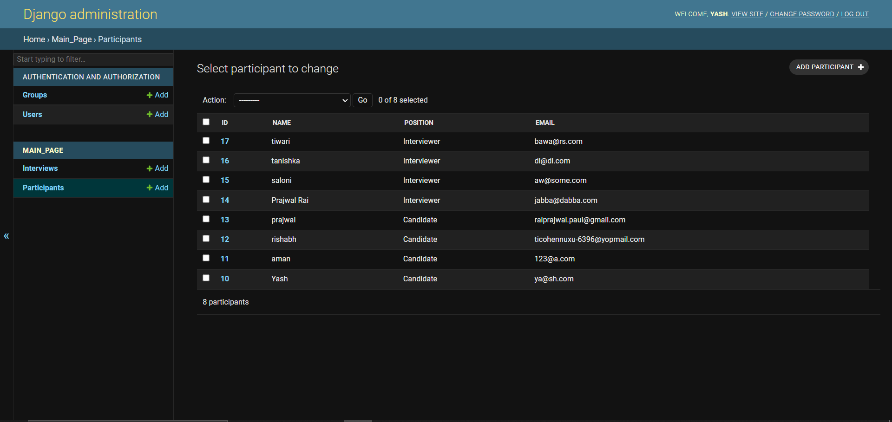

# Interview Scheduler Project

### This is a single page interview scheduling application powered by Django as backend and uses SQLite3 database for development and demonstrates Many to many relationship between interview and participant table. It also takes care of cases of multiple scheduled interviews and the correct set of participants selected at the correct time while editing too. 

### HOME VIEW: 

### Case 01: Creating and Interview:

1. Enter Details:
     

2. Interview Scheduled:
    

### Case 02: Try to Schedule an interview where atleast one of the participant is not available in that time slot:

1. Enter Details:
     

2. Error Message from backend:
    

### Case 03: Try to edit with wrong credentials:

1. Wrong set of people (not having at least one interviewr and one candidate):
     

2. Wrong timing of selected people:
    

### Case 04: Checking link:

1. Enter Details:
     

2. Interview check result:
    

## Admin Section of the Web App:

### Admin panel:
 

### Interview table:
1. Interview table:
 

2. Interview table details:

### Participant table:
1. Participant table:
 

2. Participant table details:

Hope you like it. Suggestions are welcome.